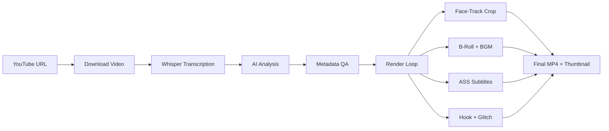

# 🎬 OpenSource Clipping

**Ultimate AI Auto-Clipper & Teaser Generator** — an open-source content factory that transforms long-form videos into cinematic short-form highlights with hook teasers, karaoke subtitles, and auto-thumbnails.

> 🇮🇩 [Baca dalam Bahasa Indonesia](README_ID.md)

---

## ✨ Features

| Feature | Description |
|---|---|
| **AI Transcriber** | Word-level transcription using **Faster-Whisper** (large-v3) |
| **AI Content Curator** | AI provider analyzes context, picks the most viral moments, and generates metadata |
| **Smart Auto-Framing** | Face-tracking via **[MediaPipe BlazeFace (Full-Range)](https://ai.google.dev/edge/mediapipe/solutions/vision/face_detector)** with Smooth Pan, Deadzone & anti-jitter algorithms |
| **Cinematic Teaser Hook** | 3-second hook with dark overlay, cinematic bars, and **TV Glitch** transition |
| **Karaoke Subtitles** | Word-by-word highlighted `.ASS` subtitles (Alex Hormozi / Veed style) |
| **Kinetic Typography** | AI-driven word emphasis with bounce/stagger animations & dual-font system |
| **B-Roll Integration** | Auto-fetches contextual stock footage from **Pexels** with crossfade & Ken Burns |
| **Auto-BGM & Ducking** | AI-matched background music from Pixabay with sidechain ducking |
| **Auto-Thumbnail** | Frame extraction with dark overlay and large title text |
| **Cross-Platform Metadata** | YouTube title/description/tags + TikTok caption — all in English |
| **Auto YouTube Uploader** | Automatically upload highlight clips to YouTube with scheduling support and full metadata (optional) |
| **Podcast Split-Screen** | Auto speaker diarization via **Pyannote** with top-bottom split-screen layout for podcasts (9:16). Supports **3+ speakers across multiple scenes** with per-speaker frozen frame fallback |
| **Podcast Camera Switch** | Auto active-speaker detection with scene-aware switching — full 9:16 crop focuses on whoever is talking; blurred pillarbox only when speakers in the same scene talk simultaneously (9:16) |

## 📋 Prerequisites

- **Python** 3.10+
- **FFmpeg** installed and available in PATH
- **CUDA GPU** recommended (for Whisper; CPU fallback available)
- **AI provider API key** (Gemini or custom gateway)
- **Pexels API Key** (optional, for B-roll — [get one here](https://www.pexels.com/api/))
- **HuggingFace Token** (optional, for split-screen / camera-switch — [get one here](https://huggingface.co/settings/tokens), requires accepting [Pyannote model agreement](https://huggingface.co/pyannote/speaker-diarization-3.1))

## ☁️ Running on Google Colab (Recommended)

If you don't have a local GPU, the easiest way to run this pipeline is via **Google Colab**.
Open a new Google Colab notebook, set the Runtime to **T4 GPU**, and create the following cells:

**Cell 1: Setup & Clone**
```python
!rm -rf ./* ./.*
!git clone https://github.com/your-username/opensource-clipping.git .
!pip install -r requirements.txt
```

**Cell 2: Setup API Keys**
```python
import os
from pathlib import Path
from google.colab import userdata

# Store your keys in Colab Secrets first!
GEMINI_API_KEY = userdata.get("GEMINI_API_KEY")

env_text = f"GEMINI_API_KEY={GEMINI_API_KEY}\n"
Path(".env").write_text(env_text, encoding="utf-8")
```

**Cell 3: Execute (Example including Kaggle fallback for float32)**
```python
URL_YOUTUBE = "https://www.youtube.com/watch?v=Dc4_aBFAYWE&pp=0gcJCdkKAYcqIYzv"
JUMLAH_CLIP = 10
RASIO = "9:16"
FONT_STYLE = "DEFAULT"
GEMINI_MODEL = "gemini-3-flash-preview"
# Use 'float32' for Kaggle CPU/T4 limitations, or 'float16' for standard Colab T4 GPUs
WHISPER_COMPUTE_TYPE = "float32"

!python main.py \
  --url "{URL_YOUTUBE}" \
  --clips {JUMLAH_CLIP} \
  --ratio "{RASIO}" \
  --font-style "{FONT_STYLE}" \
  --hook-duration 3 \
  --words-per-sub 5 \
  --ai-model "{GEMINI_MODEL}" \
  --whisper-compute-type "{WHISPER_COMPUTE_TYPE}" \
  --no-bgm
```

*(Note: We have also included `notebooks/Lib_OpenSource_Clipping.ipynb` in the repo as a ready-to-use template).*

---

## 🚀 Local Quick Start

```bash
# 1. Clone the repo
git clone https://github.com/your-username/opensource-clipping.git
cd opensource-clipping

# 2. Install dependencies (pick one)
pip install -r requirements.txt          # pip / Colab
# uv sync                               # or use uv (reads pyproject.toml)

# 3. Set up API keys
cp .env.sample .env
# Edit .env and add your GEMINI_API_KEY or GATEWAY_API_KEY

# 4. Run (Must include --url)
python main.py --url "https://youtube.com/watch?v=VIDEO_ID"
# 5. Examples of Execution

# Standard run (Default options with 5 clips)
python main.py --url "https://youtube.com/watch?v=VIDEO_ID" --clips 5 --ratio 16:9

# Advanced run (Using YOLOv8 GPU Face Tracking & Custom Fonts)
python main.py --url "https://youtube.com/watch?v=VIDEO_ID" \
  --clips 7 \
  --face-detector yolo \
  --yolo-size 8m \
  --font-style STORYTELLER

# Podcast Split-Screen (2 speakers, 9:16)
python main.py --url "https://youtube.com/watch?v=PODCAST_ID" \
  --clips 3 \
  --ratio "9:16" \
  --split-screen

# Podcast Camera Switch (auto-switches to active speaker, blurred pillarbox on overlap)
python main.py --url "https://youtube.com/watch?v=PODCAST_ID" \
  --clips 3 \
  --ratio "9:16" \
  --camera-switch \
  --switch-hold-duration 2.0

# Multi-Speaker Podcast (3 speakers across 2 scenes)
python main.py --url "https://youtube.com/watch?v=PODCAST_ID" \
  --clips 3 \
  --ratio "9:16" \
  --camera-switch \
  --diarization-speakers 3

# Manual Custom Hook (using external .mp4 clip)
python main.py --url "VIDEO_URL" --hook-source "DRIVE_URL_OR_PATH" --hook-source-start 5.0 --hook-duration 4
```

## ⚙️ CLI Options

```
python main.py --help
```

| Argument | Default | Description |
|---|---|---|
| `--url`, `-u` | — | YouTube video URL to process (Required) |
| `--clips`, `-n` | `7` | Number of highlight clips to generate |
| `--ratio`, `-r` | `9:16` | Output aspect ratio (`9:16` or `16:9`) |
| `--words-per-sub` | `5` | Max words per karaoke subtitle group |
| `--hook-duration` | `3` | Hook teaser duration (seconds) |
| `--font-style` | `HORMOZI` | Font preset (`DEFAULT`, `STORYTELLER`, `HORMOZI`, `CINEMATIC`) |
| `--no-broll` | — | Disable B-roll footage |
| `--no-hook` | — | Disable hook glitch teaser |
| `--hook-source` | `None` | Google Drive URL or local path for a single custom hook video (.mp4) |
| `--hook-source-start` | `0.0` | Start time in seconds for the custom hook video |
| `--no-bgm` | — | Disable background music |
| `--no-subs` | — | Disable all subtitle rendering |
| `--no-karaoke` | — | Use clean text instead of karaoke highlight |
| `--advanced-text` | `False` | Enable kinetic typography (word scaling & animation) |
| `--advanced-text-hook` | `False` | Enable kinetic typography specifically on the hook teaser |
| `--use-dlp-subs` | — | Use YouTube's built-in subtitles to speed up process (skips Whisper if found) |
| `--face-detector` | `mediapipe` | AI model for face tracking (`mediapipe` or `yolo`) |
| `--box-face-detection` | `False` | Draw yellow bounding boxes for tracking debug |
| `--dev-mode` | `False` | **[Experimental]** Enable 16:9 context visualization for 9:16 tracking/stabilization process |
| `--dev-mode-with-output` | `False` | **[Experimental]** Generates both the final production video and the dev dashboard video simultaneously. |
| `--dev-mode-with-output-merge` | `False` | **[Experimental]** Generates a merged ultrawide side-by-side video of the final output and the dev dashboard with boxed framing (v0.9.3). |
| `--track-lines` | `False` | Draw crosshair tracking lines extending from the face box to the boundaries |
| `--yolo-size` | `8m` | YOLO face track model (`8n`, `8s`, `8m`, `8n_v2`, `9c`) |
| `--whisper-model` | `large-v3` | Whisper model size ([see here](https://github.com/SYSTRAN/faster-whisper?tab=readme-ov-file#whisper) for options) |
| `--whisper-device` | `cuda` | Whisper device (`cuda`, `cpu`, `auto`) |
| `--whisper-compute-type` | `float16` | Compute type for Whisper (`float16`, `int8`, etc.) |
| `--ai-provider` | `gemini` | AI provider selection: `gemini` or `gateway` |
| `--ai-model` | `gemini-3-flash-preview` | AI model name |
| `--load-gemini-json` | `False` | Load the saved `ai_response.json` from the output directory to bypass the AI call |
| `--split-screen` | `False` | Enable split-screen mode for podcasts (9:16 only, requires `HF_TOKEN`). Supports 3+ speakers across multiple scenes |
| `--dynamic-split` | `False` | Automatically switch between full-screen and split-screen based on activity (requires `--split-screen`) |
| `--split-trigger` | `diarization` | Trigger for splitting: `diarization` (audio-based) or `face` (visual count) |
| `--diarization-speakers` | `auto` | Number of speakers for diarization (set to `3` for exact 3 speakers, or `auto` for visual AI auto-detection) |
| `--camera-switch` | `False` | Enable camera-switch mode for podcasts — full 9:16 crop switches to the active speaker; blurred pillarbox on simultaneous speech (9:16 only, requires `HF_TOKEN`) |
| `--switch-hold-duration` | `2.0` | Min seconds to hold on current speaker before switching (camera-switch only) |
| `--track-step` | `None` | Face detection frequency in seconds (default: `0.25`) |
| `--track-deadzone` | `None` | Camera deadzone ratio where subject stays centered (default: `0.15`) |
| `--track-smooth` | `None` | Camera catch-up speed factor (default: `0.30`) |
| `--track-jitter` | `None` | Pixel threshold to ignore micro-shakes (default: `5`) |
| `--track-snap` | `None` | Jump threshold to trigger hard cut between speakers (default: `0.25`) |
| `--track-conf` | `0.55` | **[Experimental]** Face detection confidence threshold (raise to prevent ghosts) |
| `--track-smooth-window` | `12` | **[Experimental]** Frame window for layout stability (12 frames ≈ 0.5s) |
| `--scene-cut-threshold` | `18` | **[Experimental]** Sensitivity for camera-cut detection (instantly resets history) |
| `--track-iou-threshold` | `0.2` | **[Experimental]** Overlap threshold for merging duplicate detections |

## 🎙️ Podcast Modes

When processing podcast videos, you can choose between several intelligent rendering modes. These modes support **3+ speakers across multiple scenes**.

### 1. **`--split-screen` (Split Layout)**
Divides the screen into panels to show multiple speakers simultaneously.
*   **Default:** Permanent **Top-Bottom** layout (supports 3+ speakers via panel-swapping).
*   **`--dynamic-split`:** Automatically switches between **Full 9:16** (when 1 person is talking/visible) and **Split** (when 2+ are active).
*   **Trigger Modes (`--split-trigger`):**
    *   **`diarization` (Default):** Uses audio to know who is talking. Requires `HF_TOKEN`. Dimming effect on inactive speaker.
    *   **`face`:** Uses visual face count. **No token required**. No dimming effect.
*   **Best for:** Educational podcasts or when reaction shots are important.

### 2. **`--camera-switch` (Cinematic Switching)**
Mimics professional editing by focusing only on the active speaker in full screen.
*   **Tampilan:** **Full 9:16** that cuts between speakers.
*   **Scene-Aware:** Automatically uses **Blurred Pillarbox** if two people in the same wide-shot are talking; otherwise stays in clean full-crop.
*   **Best for:** Storytelling, interviews, or high-energy clips.

---

### **Comparison Table**

| Feature | `--split-screen` | `--camera-switch` |
| :--- | :--- | :--- |
| **Visual Layout** | Split (Top-Bottom) | Full Screen (Switching) |
| **Dynamic Mode** | ✅ `--dynamic-split` (Auto-toggle) | ✅ Always Dynamic |
| **Trigger Source** | Audio or Visual (`--split-trigger`) | Audio Only (Diarization) |
| **Reaction Shots** | ✅ Both speakers visible | ❌ Only 1 speaker visible |
| **Requirement** | Optional `HF_TOKEN` (Visual mode needs no token) | `HF_TOKEN` (Required) |

> [!TIP]
> Use `--split-screen --dynamic-split --split-trigger face` for the fastest rendering without needing any special API tokens or Diarization models.

---

## 🚀 Quick Start Examples

```bash
# 1. Standard AI Clipping (7 clips, 9:16)
python main.py --url "VIDEO_URL"

# 2. Dynamic Split-Screen (Visual-based, NO TOKEN REQUIRED)
python main.py --url "VIDEO_URL" --split-screen --dynamic-split --split-trigger face

# 3. Dynamic Split-Screen (Audio-based, Highlight active speaker, needs HF_TOKEN)
python main.py --url "VIDEO_URL" --split-screen --dynamic-split --split-trigger diarization

# 4. Cinematic Camera Switch (Needs HF_TOKEN)
python main.py --url "VIDEO_URL" --camera-switch
```

> [!IMPORTANT]
> Audio-based features (diarization) require a **HuggingFace Token** (`HF_TOKEN`) in your `.env` file and acceptance of the Pyannote model agreement on HuggingFace.

## 🐍 Recommended Configurations (Notebook/Colab)

These are verified configurations for optimal results in different scenarios.

### 1. Standard Mode (Standard Clipping)
Best for general videos where you want the best accuracy and focus.
```python
# Constants for Standard Clipping
URL_YOUTUBE = "https://www.youtube.com/watch?v=UXhdIF8kvCI"
JUMLAH_CLIP = 7
RASIO = "9:16"
FONT_STYLE = "DEFAULT"
GEMINI_MODEL = "gemini-2.0-flash"

!python main.py \
  --url "{URL_YOUTUBE}" \
  --clips {JUMLAH_CLIP} \
  --ratio "{RASIO}" \
  --font-style "{FONT_STYLE}" \
  --hook-duration 3 \
  --words-per-sub 5 \
  --face-detector yolo \
  --ai-model "{GEMINI_MODEL}" \
  --no-bgm \
  --no-subs \
  --no-broll \
  --use-dlp-subs
```

### 2. Split-Screen Mode (Podcasts)
Optimized for podcasts with 2+ speakers using stable YOLO detection.
```python
# Constants for Split-Screen
URL_YOUTUBE = "https://www.youtube.com/watch?v=UXhdIF8kvCI"
JUMLAH_CLIP = 3
RASIO = "9:16"
FONT_STYLE = "DEFAULT"
GEMINI_MODEL = "gemini-2.0-flash"

!python main.py \
  --url "{URL_YOUTUBE}" \
  --clips {JUMLAH_CLIP} \
  --ratio "{RASIO}" \
  --font-style "{FONT_STYLE}" \
  --hook-duration 3 \
  --words-per-sub 5 \
  --ai-model "{GEMINI_MODEL}" \
  --no-bgm \
  --no-subs \
  --no-broll \
  --split-screen \
  --dynamic-split \
  --split-trigger face \
  --face-detector yolo \
  --use-dlp-subs
```

## 📂 Project Structure

```
opensource-clipping/
├── main.py                  # CLI entry point
├── run_upload.py            # YouTube auto-uploader CLI
├── pyproject.toml           # Dependencies & metadata
├── .env.sample              # API key template
├── .gitignore
├── README.md                # English docs
├── README_ID.md             # Indonesian docs
├── clipping/
│   ├── __init__.py
│   ├── config.py            # Master configuration & argparse
│   ├── engine.py            # Download → Transcribe → AI analysis
│   ├── diarization.py       # Pyannote speaker diarization (split-screen & camera-switch)
│   ├── metadata.py          # QA metadata normalization
│   ├── studio.py            # Video render engine (face-track, split-screen, camera-switch, subs, B-roll, BGM)
│   └── runner.py            # Pipeline orchestrator
└── youtube_uploader/
    ├── __init__.py
    └── uploader.py          # YouTube upload & scheduling logic
```

## 🔄 Pipeline Flow



## 📤 Output

For each clip, the pipeline creates an `outputs/` directory and generates:

| File | Description |
|---|---|
| `outputs/highlight_rank_N_ready.mp4` | Final rendered clip with subtitles, B-roll, BGM |
| `outputs/thumbnail_rank_N.jpg` | Auto-generated thumbnail with title text |
| `outputs/render_manifest.json` | Manifest with metadata for all clips |
| `outputs/metadata_preview.json` | AI-generated metadata (titles, tags, captions) |

## 🎵 Font Styles

| Style | Main Font | Emphasis Font | Best For |
|---|---|---|---|
| `HORMOZI` | Montserrat | Anton | Business / motivational |
| `STORYTELLER` | Inter | Lora | Narrative / storytelling |
| `CINEMATIC` | Roboto | Bebas Neue | Film / dramatic |
| `DEFAULT` | Montserrat Black | Montserrat Medium | General purpose |

## 📺 Auto-Upload to YouTube

The project now includes a standalone YouTube auto-uploader with scheduling support!

1. Place your configured `youtube_token.json` file inside the `.credentials/` directory.
2. After the rendering process finishes, the script will automatically read from the generated `outputs/` directory (e.g., `outputs/render_manifest.json` and the final videos). Simply run the uploader:
   ```bash
   # Basic run (uses default 8-hour interval and auto timezone)
   python run_upload.py

   # Or run with custom arguments (example):
   python run_upload.py --interval-hours 12 --tz-name "Asia/Jakarta"
   ```
3. To run a test with only the first video, use `python run_upload.py --test-mode`. Run `python run_upload.py --help` to see all scheduling and timezone options.

## 📄 License

Open source. Feel free to use, modify, and distribute.
