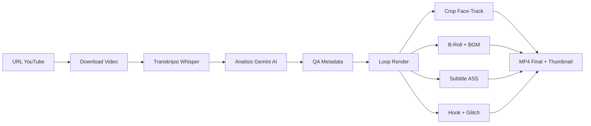

# 🎬 OpenSource Clipping v0.3.0

**Ultimate AI Auto-Clipper & Teaser Generator** — proyek open-source yang mengubah video panjang menjadi highlight pendek bergaya sinematik, lengkap dengan hook teaser, subtitle karaoke, dan thumbnail otomatis.

> 🇬🇧 [Read in English](README.md)

---

## ✨ Fitur Utama

| Fitur | Deskripsi |
|---|---|
| **AI Transcriber** | Transkripsi per-kata dengan akurasi tinggi menggunakan **Faster-Whisper** (large-v3) |
| **AI Content Curator** | **Google Gemini** menganalisis konteks, memilih momen paling viral, dan membuat metadata |
| **Smart Auto-Framing** | Pelacakan wajah **MediaPipe** dengan algoritma Smooth Pan, Deadzone & anti-jitter |
| **Cinematic Teaser Hook** | Hook 3 detik dengan overlay gelap, cinematic bars, dan transisi **TV Glitch** |
| **Karaoke Subtitles** | Subtitle `.ASS` yang menyala per-kata (gaya Alex Hormozi / Veed) |
| **Kinetic Typography** | Penekanan kata otomatis dengan animasi bounce/stagger & sistem dual-font |
| **B-Roll Integration** | Mengambil stock footage kontekstual dari **Pexels** dengan crossfade & Ken Burns |
| **Auto-BGM & Ducking** | Musik latar otomatis dari Pixabay dengan sidechain ducking |
| **Auto-Thumbnail** | Ekstraksi frame dengan overlay gelap dan teks judul besar |
| **Metadata Lintas Platform** | Judul/deskripsi/tag YouTube + caption TikTok — semua dalam Bahasa Inggris |

## 📋 Prasyarat

- **Python** 3.10+
- **FFmpeg** terinstall dan tersedia di PATH
- **GPU CUDA** disarankan (untuk Whisper; bisa fallback ke CPU)
- **Google Gemini API Key** ([dapatkan di sini](https://aistudio.google.com/apikey))
- **Pexels API Key** (opsional, untuk B-roll — [dapatkan di sini](https://www.pexels.com/api/))

## ☁️ Menjalankan di Google Colab (Direkomendasikan)

Jika Anda tidak memiliki GPU di laptop/PC, cara termudah untuk menjalankan pipeline ini adalah melalui **Google Colab**.
Buka notebook Google Colab baru, pastikan Runtime memakai **T4 GPU**, lalu jalankan cell berikut secara berurutan:

**Cell 1: Setup & Clone**
```python
!rm -rf ./* ./.*
!git clone https://github.com/your-username/opensource-clipping.git .
!pip install -r requirements.txt
```

**Cell 2: Setup API Keys**
```python
import os
from pathlib import Path
from google.colab import userdata

# Daftarkan GOOGLE_API_KEY di menu Secrets Colab (ikon kunci)
GOOGLE_API_KEY = userdata.get("GOOGLE_API_KEY")

env_text = f"GOOGLE_API_KEY={GOOGLE_API_KEY}\n"
Path(".env").write_text(env_text, encoding="utf-8")
```

**Cell 3: Eksekusi**
```python
URL_YOUTUBE = "https://www.youtube.com/watch?v=Ip6pCjWp4lk"

!python main.py \
  --url "{URL_YOUTUBE}" \
  --clips 5 \
  --ratio "9:16" \
  --font-style "HORMOZI"
```

*(Catatan: Kami juga telah menyertakan file `notebooks/Lib_OpenSource_Clipping.ipynb` di repositori ini sebagai template praktis).*

---

## 🚀 Cara Cepat (Lokal)

```bash
# 1. Clone repo
git clone https://github.com/your-username/opensource-clipping.git
cd opensource-clipping

# 2. Install dependensi (pilih salah satu)
pip install -r requirements.txt          # pip / Colab
# uv sync                               # atau pakai uv (baca pyproject.toml)

# 3. Setup API key
cp .env.sample .env
# Edit file .env dan masukkan GOOGLE_API_KEY kamu

# 4. Jalankan dengan default
python main.py
# uv run main.py                        # jika pakai uv

# 5. Atau kustomisasi
python main.py --url "https://youtube.com/watch?v=VIDEO_ID" --clips 5 --ratio 16:9
```

## ⚙️ Opsi CLI

```
python main.py --help
```

| Argumen | Default | Deskripsi |
|---|---|---|
| `--url`, `-u` | *(URL preset)* | URL video YouTube yang akan diproses |
| `--clips`, `-n` | `7` | Jumlah klip highlight yang dihasilkan |
| `--ratio`, `-r` | `9:16` | Rasio aspek output (`9:16` atau `16:9`) |
| `--words-per-sub` | `5` | Maks kata per grup subtitle karaoke |
| `--hook-duration` | `3` | Durasi hook teaser (detik) |
| `--font-style` | `HORMOZI` | Preset font (`DEFAULT`, `STORYTELLER`, `HORMOZI`, `CINEMATIC`) |
| `--no-broll` | — | Nonaktifkan footage B-roll |
| `--no-hook` | — | Nonaktifkan hook glitch teaser |
| `--no-bgm` | — | Nonaktifkan musik latar |
| `--no-karaoke` | — | Gunakan teks biasa tanpa highlight karaoke |
| `--advanced-text` | `False` | Aktifkan kinetic typography (scaling & animasi kata) |
| `--whisper-model` | `large-v3` | Ukuran model Whisper ([lihat opsi di sini](https://github.com/SYSTRAN/faster-whisper?tab=readme-ov-file#whisper)) |
| `--whisper-device` | `cuda` | Device Whisper (`cuda`, `cpu`, `auto`) |
| `--whisper-compute-type` | `float16` | Tipe komputasi Whisper (`float16`, `int8`, dll) |
| `--gemini-model` | `gemini-3-flash-preview` | Nama model Gemini |

## 📂 Struktur Proyek

```
opensource-clipping/
├── main.py                  # Entry point CLI
├── pyproject.toml           # Dependensi & metadata proyek
├── .env.sample              # Template API key
├── .gitignore
├── README.md                # Dokumentasi (English)
├── README_ID.md             # Dokumentasi (Indonesia)
└── clipping/
    ├── __init__.py
    ├── config.py            # Konfigurasi master & argparse
    ├── engine.py            # Download → Transkripsi → Gemini AI
    ├── metadata.py          # Normalisasi & QA metadata
    ├── studio.py            # Mesin render video (face-track, subs, B-roll, BGM)
    └── runner.py            # Orkestrator pipeline
```

## 🔄 Alur Pipeline



## 📤 Output

Untuk setiap klip, pipeline menghasilkan:

| File | Deskripsi |
|---|---|
| `highlight_rank_N_ready.mp4` | Klip final dengan subtitle, B-roll, BGM |
| `thumbnail_rank_N.jpg` | Thumbnail otomatis dengan teks judul |
| `render_manifest.json` | Manifest berisi metadata semua klip |
| `metadata_preview.json` | Metadata dari Gemini (judul, tag, caption) |

## 🎵 Gaya Font

| Gaya | Font Utama | Font Penekanan | Cocok Untuk |
|---|---|---|---|
| `HORMOZI` | Montserrat | Anton | Bisnis / motivasi |
| `STORYTELLER` | Inter | Lora | Narasi / storytelling |
| `CINEMATIC` | Roboto | Bebas Neue | Film / dramatis |
| `DEFAULT` | Montserrat Black | Montserrat Medium | Serbaguna |

## 🎛️ Penjelasan Parameter Konfigurasi

**▶️ Pengaturan Utama**
- `--url` : Link video YouTube sumber
- `--clips` : Berapa banyak klip yang ingin dihasilkan
- `--ratio` : `9:16` untuk TikTok/Reels/Shorts, `16:9` untuk YouTube biasa

**🎬 Pengaturan Konten & Hook**
- `--words-per-sub` : Jumlah maksimal kata yang muncul di layar (karaoke style)
- `--hook-duration` : Durasi teaser di awal video (detik)
- `--no-broll` : Matikan fitur B-roll (stock footage otomatis)
- `--no-hook` : Matikan hook glitch di awal klip

**🎨 Pengaturan Subtitle (ASS)**
- `--font-style` : Pilih gaya font untuk subtitle
- `--no-karaoke` : Matikan efek warna kuning per-kata, ganti dengan teks bersih muncul satu per satu
- `--advanced-text` : Aktifkan efek scaling kata besar-kecil (kinetic typography)

**🌐 Asset Eksternal**
- Semua asset pendukung (Model AI, Glitch video, Font) akan diunduh **otomatis** saat pertama kali dijalankan

## 📺 Upload Otomatis ke YouTube

Proyek ini sekarang menyertakan uploader YouTube mandiri (standalone) dengan dukungan penjadwalan (scheduling) otomatis!

1. Tempatkan file `youtube_token.json` Anda yang telah dikonfigurasi ke dalam folder `.credentials/` (buat foldernya secara manual jika belum ada).
2. Setelah proses render secara keseluruhan selesai (dan file `render_manifest.json` telah siap), jalankan script uploader:
   ```bash
   # Mode biasa (default interval 8 jam & scheduling otomatis)
   python run_upload.py

   # Atau jalankan dengan argumen kustom (contoh):
   python run_upload.py --interval-hours 12 --tz-name "Asia/Jakarta"
   ```
3. Untuk mengetes hanya dengan video pertama, jalankan dengan argumen `--test-mode`. Gunakan perintah `python run_upload.py --help` untuk melihat opsi timezone dan interval penjadwalan.

## 📄 Lisensi

Open source. Bebas digunakan, dimodifikasi, dan didistribusikan.
